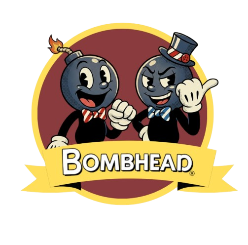

# BombHead



## 1. Identificação do Projeto
- **Título do Projeto:** BombHead
- **Identificação do Desenvolvedor:** Bernardo Rodrigues

## 2. Visão Geral do Sistema
- **Descrição:** Game de tiro/plataforma 2D desenvolvido em JavaScript Vanilla com HTML5 Canvas. Trata-se de um estudo de caso prático para a disciplina de Programação Orientada a Objetos.
- **Objetivo:** O jogador deve desbravar o mapa e sobreviver a 3 fases consecutivas, onde enfrentará desafios crescentes, desviando de tiros e derrotando o boss final de cada cenário.
- **Tema:** Jogo 2D interativo mesclando elementos de tiro (shooter), aventura e plataforma.
- **Estrutura de Fases:**
  - **Fase 1 - EL CASINO (Fácil):** Boss com 5 pontos de vida. Foco em esquiva simples e pulos básicos no chão. O jogador conta com 5 vidas iniciais.
  - **Fase 2 - A TORMENTA (Normal):** Boss com 8 pontos de vida. Introdução a mecânicas de plataforma (pulos entre as nuvens). O jogador deve calcular bem as distâncias para não cair do cenário e perder vidas.
  - **Fase 3 - O GENERAL (Difícil):** Boss com 10 pontos de vida. A jogabilidade muda para um combate de voo aéreo (movimentação livre no eixo Y). A velocidade dos tiros aumenta e o jogador conta com apenas 4 vidas iniciais.

## 3. Instruções de Jogabilidade
- **No Mapa de Fases:**
  - Movimentação pelo cenário: `W`, `A`, `S`, `D` ou `Setas Direcionais`.
  - Ingressar na fase: `Enter` (quando sobre o ícone de uma fase desbloqueada).
- **Nas Fases 1 e 2 (Estilo Plataforma):**
  - Movimentação horizontal: `A`, `D` ou `Setas (Esquerda/Direita)`.
  - Pular: `W`, `Seta para Cima` ou `Barra de Espaço`.
  - Disparar: `L` ou `Z`.
- **Na Fase 3 (Estilo Voo):**
  - Movimentação vertical: `W`, `S` ou `Setas (Cima/Baixo)`.
  - Disparar: `L` ou `Z`.
- **Voltar/Sair:** Em qualquer fase ou no mapa, utilize a tecla `ESC` para voltar ao menu anterior.
- **Modos de Jogo:** O game possui as opções de campanha single-player (1 JOGADOR) e o modo colaborativo (2 JOGADORES).

## 4. Especificações Técnicas
- **Linguagem e Tecnologias:** HTML5 (Canvas API), CSS3 (Estilização de menus) e JavaScript (ES6+).
- **Paradigma e Arquitetura:** Fortemente baseado em Programação Orientada a Objetos (POO). Uso de classes para `Personagens`, `Inimigos`, `Projéteis/Tiros`, `Plataformas` e `Fundo`.
- **Sistema de Colisão:** Utiliza hitboxes (caixas de colisão - AABB) para calcular interações precisas e com uso de *cooldowns* (períodos de invencibilidade) ao tomar danos.
- **Game Loop:** Processado utilizando o `requestAnimationFrame` nativo do browser, que garante fluidez e estabilidade gráfica (~60 FPS).
- **Armazenamento e Progressão:** Salvamento progressivo de fases liberadas realizado diretamente no navegador através da API de `localStorage`.

## 5. Instruções de Instalação e Execução
Como um terceiro pode rodar este projeto:

1. **Clonagem:**
   ```bash
   git clone [url-do-repositorio]
   ```
2. **Execução Local:**
   - Devido à sua natureza Vanilla (HTML/JS/CSS puros), não é necessária a instalação de módulos npm ou processos de transpilação.
   - Basta navegar até o diretório do projeto clonado e abrir o arquivo `index.html` em qualquer navegador atual (Google Chrome, Firefox, Edge).
   - *Dica/Recomendação:* Para evitar problemas locais de política do navegador com imagens (CORS), recomenda-se a utilização de um servidor local, como a extensão **Live Server** para o VSCode.
3. **Produção / Deploy:**
   [Link do Vercel - Inserir o link aqui](#) *(Substitua este espaço em branco pelo URL real do projeto quando hospedado no Vercel).*

## 6. Créditos
- **Desenvolvedor:** Bernardo Rodrigues
- **Product Owner:** Professor Orientador
